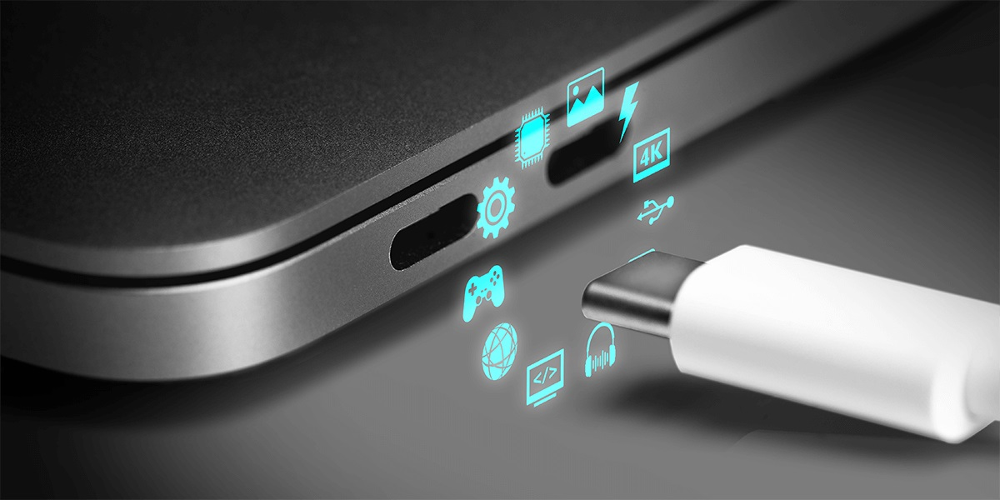
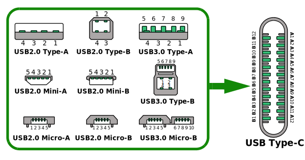

È da 5/6 anni che si sente parlare di USB Type-C, il connettore del futuro che sta conquistando il mondo, il cavo USB Type-C è un cavo a 24 pin reversibile creato dall'USB-IF, la prima specifica è stata rilasciata nell'agosto 2004. Il cavo USB Type-C è un connettore universale che soddisfa le esigenze di una vasta gamma di applicazioni di elaborazione, visualizzazione e ricarica. L'obiettivo a lungo termine del cavo USB Type-C è quello di sostituire tutte le precedenti versioni del connettore USB, ampliando notevolmente le capacità complessive[^AN1953].

Il principale vantaggio dell'USB Type-C è che il connettore è reversibile, quindi non c'è bisogno di provare a girarlo 2 o 3 volte prima di riuscire ad inserirlo, poiché entra sempre alla prima volta, ma non è finita quà, vediamo in dettaglio le principali novità:

## 5, 10 e 20 Gbps

Il connettore USB Type-C, grazie ai suoi 24 pin, più del doppio rispetto ai 9/10 pin dei precedenti form factor garantisce due linee indipendenti USB SuperSpeed garantendo quindi una velocità massima di 20 Gbps (due linee da 10 Gbps), attualmente, l'attuale standard USB3.2 esistono 5 possibili configurazioni di velocità, all'interno di un cavo USB Type-C:
- USB2.0: usa solo la linea HighSpeed, con una velocità massima 480 Mbps
- USB3.2 Gen 1×1 (ex USB 3.0, USB 3.1 Gen 1): usa una linea SuperSpeed, con una velocità massima di 5 Gbps
- USB3.2 Gen 1×2: usa una linea SuperSpeed, con una velocità massima di 10 Gbps
- USB3.2 Gen 2×1 (ex USB 3.1 Gen 2): usa due linee SuperSpeed, con una velocità massima di 10 Gbps
- USB3.2 Gen 2×2: usa due linee SuperSpeed, con una velocità massima di 10 Gbps

Per comprendere meglio questa lista è bene ricordare che l'USB3.0 ha deciso di introdurre nuovi PIN dedicati alle linee SuperSpeed, in aggiunta alla linea HighSpeed, infatti in quasi tutti i connettori è possibile notare una sorta di "depandance" dedicata ad ospitare le nuove linee SuperSpeed, questo fa si che un cavo USB3.0 è dotato di una linea SuperSpeed (caratterizzata da 4 fili RX+, RX-, TX+, TX-) ed una linea HighSpeed (caratterizzata da 2 fili D+ e D-). Questo è stato fatto principalmente per garantire una maggiore compatibilità con i dispositivi legacy, una interessante conseguenza di questa scelta è che buonaparte degli Hub USB hanno due chip separati, uno per le linee HighSpeed e uno per le linee SuperSpeed.

La configurazione USB2.0 è la minima richiesta dall'USB-IF, mentre le configurazioni USB3.2 Gen 1×1 e USB3.2 Gen 1×2 possono essere utilizzate anche con connettori USB3.0 Type-A e Type-B, e richiedono un cavo di 10 fili. Mentre invece le configurazioni 2×1 e 2×2 richiede l'uso di un cavo che supporti due linee di trasmissione indipendenti, quindi entrambi i connettori devono essere USB Type-C, ed il cavo deve avere 24 fili. 

Prima dell'introduzione di USB Type-C e USB Power Delivery, i ruoli di dati e alimentazione erano tipicamente fissi. La forma del connettore determinava sia il ruolo dei dati che quello dell'alimentazione:
- Downstream Facing Port: classica porta in modalità host, in genere veniva utilizzato un connettore USB Type-A
- Upstream Facing Port (UFP): classica porta in modalità dispositivo, in genere veniva utilizzato un connettore USB Type-B

Nonostante ciò negli anni è emerso che questo era ampiamente limitante, e quindi è stato introdotto per esempio lo standard USB OTG, che permette l'uso dei connettori USB Type-B come Dual-Role Port (DRP). Infine un altro grosso problema è l'assenza di standard relativi al Power Delivery, originariamente era standarizzato solamente il Power Delivery a 5V, 500 mA, ma con il tempo si è visto che questo era un grosso problema, inoltre il roulo dell'alimentazione è ben definito, cioè Host to Device. Il connettore USB Type-C permette l'utilizzo dei connettori in tutte e tre le modalità, inoltre permette anche che i rouli relativi al Power Delivery possono essere scambiati in modo indipendente e dinamico utilizzando il protocollo USB Power Delivery. A causa di ciò, ci sono alcune nuove terminologie che vengono utilizzate per descrivere i sistemi USB Type-C.

## Power Delivery 

L'USB Power Delivery è un protocollo che consente la trasmissione di potenza attraverso un cavo USB Type-C, offrendo una maggiore flessibilità e una capacità di ricarica più rapida. Con il protocollo Power Delivery, è possibile erogare fino a 100 W di potenza da o verso i dispositivi, il che significa che i dispositivi possono essere ricaricati più rapidamente e possono anche utilizzare la stessa porta per la connessione dati e l'alimentazione. Inoltre, il protocollo Power Delivery supporta la negoziazione della potenza di alimentazione necessaria per il dispositivo, il che significa che il dispositivo che richiede energia può negoziare la quantità di potenza necessaria e l'alimentatore di alimentazione può fornire la quantità esatta. Ciò garantisce che i dispositivi ricevano solo la quantità di energia di cui hanno bisogno, riducendo così il rischio di danni dovuti all'eccesso di alimentazione e migliorando la durata della batteria dei dispositivi mobili.

## Modalità ALT

Un secondo importante vantaggio è la modalità “ALT” che permette di utilizzare tutte o alcune linee SuperSpeed per tramettere segnali alternativi all'USB, come DisplayPort, MHL, HDMI e Thunderbolt.

Questo permette o permette di collegare uno (o più monitor sfruttando la tecnologia MST, presente ormai su qualsiasi DisplayPort) attraverso un unico cavo e poter collegare al monitor tastiera e mouse. Permettendo quindi di poter staccare un unico cavo USB Type-C da un PC e collegarlo a un altro PC senza dover spostare decine di connettori, inoltre grazie alla combinazione PD + modalità ALT è possibile ricaricare il computer direttamente dal monitor. Nel 2021 sempre più portatili hanno USB Type-C, magari pure con funzionalità PD (Power Delivery), come i Mac Book, Dell, Lenovo, Asus, ed è importante selezionare attentamente computer e monitor affinché la porta Type-C sia presente.

La modalità ALT DisplayPort supporta anche più flussi video, cioè lo standard MST di DisplayPort, in particolare, è possibile effettuare un colleggamento in cascata di più monitor attraverso un unico cavo USB Type-C, l'unico problema è che i MacBook non supportino l'MST[^apple_mst].

Lato invece computer fissi sembra che l’ora non sia arrivata infatti solamente le GPU Nvidia RTX serie 2000 e le GPU AMD RT serie 5000 hanno una uscita USB Type-C ALT DisplayPort. Ma questo non vieta i pionieri dell’USB Type-C di trovare una alternativa, cercando sui vari forum, blog e reddit relativi all’USB Type-C ho trovato [Sunix UPD2018, Sunix UPA2015, WJESOG DP cable e WJESOG HDMI cable](https://dancharblog.wordpress.com/2020/07/20/add-usb-c-with-dp-alt-mode-to-your-desktop-pc/): permette di creare una USB Type-C ALT DisplayPort[^dan_usb_c]. 

In particolare gli adattatori Sunix permettono la modalità di funzionamento in modalità USB ALT DP High Speed e USB ALT DP High Resolution (attenzione a non confondere High Speed con le linee USB HighSpeed), possiamo vedere le caratteristiche di queste modalità nella seguente tabella:

|                   | USB ALT DP High Speed                                            | USB ALT DP High Resolution                                |
| ----------------- | ---------------------------------------------------------------- | --------------------------------------------------------- |
| DP 1.2a (HBR2)    | 1×SuperSpeed Line (5 o 10 Gbps) + 1×4K30/1×2K60/2×1080p60        | 1×HighSpeed Line (480 Mbps) + 2×4K30/2×2K60/4×1080p60     |
| DP 1.3/1.4 (HBR3) | 1×SuperSpeed Line (5 o 10 Gbps) + 1×4K60/2×4K30/2×2K60/4×1080p60 | 1×HighSpeed Line (480 Mbps) + 1x4K60/2×4K60/4×4K30/4×2K60 |

- Sunix UPD2018 supporta USB ALT DP High Resolution e USB ALT DP High Speed con DP 1.2a
- Sunix UPA2015 supporta USB ALT DP High Resolution e USB ALT DP High Speed con DP 1.2a/1.3/1.4
- WJESOG DP cable supporta solo USB ALT DP High Resolution con DP 1.2a[^dan_usb_c]

Attualmente ho 4 schede Sunix UPD2018, due WJESOG DP cable e due WJESOG HDMI cable.

La mia prima esperienza con il Sunix UPD2018 ed i monitor DELL P2421DC è stato che non funzionava e causava interferenze con il mouse, ma dopo una analisi più accurata è ermrso che il mouse, era diventato un giocattolo della gattina a mia insaputa. Attualmente mi sto trovando molto bene e sto cercando un Sunix UPD2018 per poter provare anche la modalità USB ALT DP High Speed con DP 1.4 e poter sfruttare meglio i miei due DELL P2423DE che hanno una porta Ethernet Gigabit (non sfruttabile in modalità High Resolution, necessaria per poter usare i due monitor in daisy chain)[^p2421dc],[^p2423de]. La scrivania è molto più libera, quando devo fare esami online letteralmente basta che stacchi un unico cavo e posso svuotare la scrivania in meno di tre minuti contro la decina di minuti che stavo prima. Non c’è che dire l'USB Type-C è realmente il connettore del futuro, aggiungo che la Sunix UPD2018 è un accessorio eccezionale e anche credo il miglior adattatore PCI-Ex – USB Type-C in quanto è uno dei pochi senza il connettore d’alimentazione, che sinceramente non ho mai capito cosa serva dato che la PCI-Ex è in grado di fornire fino a 75W, ma buonparte delle altre schede lo ha.

## Changelog

### 30 Aprile 2023

- Aggiunti WJESOG DP cable e WJESOG HDMI cable

### 15 Giugno 2023

- Aggiunte spiegazioni su USB ALT DP High Speed e USB ALT DP High Resolution

[^AN1953]: [AN1953: Introduction to USB Type-C](https://ww1.microchip.com/downloads/en/appnotes/00001953a.pdf)
[^apple_mst]: [Support Displayport MST? - Community Apple](https://discussions.apple.com/thread/253432530)
[^p2421dc]: [Dell 24 USB-C Monitor - P2421DC: Guida dell’utente](https://dl.dell.com/manuals/all-products/esuprt_electronics_accessories/esuprt_electronics_accessories_monitors/dell-p2421dc-monitor_user's-guide_it-it.pdf)
[^p2423de]: [Monitor Dell USB-C P2423DE/P2723DE: Guida dell’utente](https://dl.dell.com/content/manual12153386-dell-usb-c-monitor-p2423de-guida-all-uso.pdf?language=it-it)
[^dan_usb_c]: [Add USB-C with DisplayPort-alt-mode to your PC](https://dancharblog.wordpress.com/2020/07/20/add-usb-c-with-dp-alt-mode-to-your-desktop-pc/)