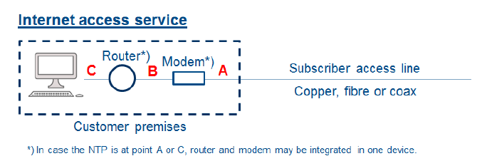

Recentemente, la Free Modem Alliance[^1] ha intensificato gli sforzi per promuovere la questione degli ONT liberi. Dopo la vittoria nella battaglia per i modem liberi nel 2018, l'attenzione si è spostata sulla crescente diffusione della FTTH, con l'obiettivo di eliminare gli ONT all'interno degli appartamenti degli utenti. Tuttavia, non è tutto oro quello che luccica, e in questo post esamineremo il perché.

Attualmente in Italia, grazie anche all'azione della Free Modem Alliance, è possibile usufruire di un router libero. Questo significa che gli utenti hanno il pieno controllo dell'apparato almeno fino al livello mac (detto anche L2). Nel caso di una connessione ADSL o VDSL/FTTC, è possibile scegliere il proprio modem. In alcuni casi, ciò consente prestazioni migliori rispetto a quelli forniti dagli ISP. È importante ricordare che ci sono chipset che si comportano meglio in determinati contesti; ad esempio, su linee lunghe è preferibile un chipset Broadcom, mentre su linee disturbate è consigliato un chipset Lantiq.

La possibilità di avere un modem libero è stata resa possibile dalla legislazione europea, in particolare dall'articolo 19 della direttiva 2018/1972 e dalla direttiva sulla Net Neutrality (2015/2120), che prevede la definizione di una terminazione chiamata NTP (Network Termination Point). Questa segna la separazione tra la rete dell'utente e quella dell'ISP. Tuttavia, le direttive non specificano il livello al quale avviene questa terminazione, lasciando interpretazioni libere alle leggi nazionali e alla discrezione degli ISP.

Grazie al lavoro svolto anche dalla Free Software Foundation Europe[^2], è possibile identificare tre tipi distinti di terminazioni:

- Tipo A, a livello fisico. In questo caso, la NTP è una presa telefonica o ottica a cui collegare il proprio modem, ONT o router.
- Tipo B, a livello Ethernet/MAC. In questo caso, la NTP è una presa Ethernet (o SFP) a cui collegare il proprio router lato WAN, mentre il router si occupa di stabilire la connessione con l'ISP attraverso i protocolli PPPoE o IPoE.
- Tipo C, a livello IP. In questo caso, la NTP è una presa Ethernet a cui collegare il proprio router lato LAN. Il routing e il NAT sono gestiti dal provider.

In alcuni paesi, come la Francia, la terminazione è sempre e solo a livello L3. Al contrario, in altri paesi come l'Italia, si adotta un approccio misto che coinvolge tutti e tre i livelli. Nello specifico, si utilizza il Tipo A per la ADSL e la VDSL/FTTC, il Tipo B per la FTTH e il Tipo C per la FWA. Puoi esplorare una panoramica dettagliata di questa situazione attraverso la mappa interattiva dell'FSFE, disponibile [qui](https://umap.openstreetmap.fr/en/map/router-freedom-tracker_581123#4/45.99/25.75). 

La situazione attuale riguardo al modem libero in Italia non è affatto disastrosa e risulta quasi perfetta, salvo alcune considerazioni per quanto riguarda la tecnologia FTTH. Per comprendere meglio la situazione, possiamo individuare tre tipologie di ONT:
- ONT Esterno: Si tratta di un ONT con una uscita RJ45, che si collega al router tramite un cavo dedicato. Questo tipo di ONT richiede un'alimentazione separata.
- ONT SFP with MAC: Questo tipo di ONT dispone di un'uscita SFP che si inserisce in un router dotato di uno slot SFP. L'uscita può essere di 1 Gbps con lo standard R/SGMII, oppure di 2.5 Gbps con 2.5 SGMII/HSGMII[^3].
- SFP w/o MAC: Questo dispositivo si occupa esclusivamente della conversione del segnale ottico in simboli equivalenti in rame. Il router in cui viene inserito funge da ONT.
- ONT Integrato: In questa configurazione, la porta ottica termina direttamente all'interno del router, che si occupa dell'autenticazione e delle funzioni ONT.

In quasi tutte le connessioni FTTH, viene fornito un ONT esterno o un ONT SFP con MAC, assicurando che l'ONT in dotazione sia già compatibile con i modem di terze parti. Ciò consente agli utenti di effettuare lo switch quando lo desiderano, senza dover chiamare il provider per ottenere l'ONT più adatto.
Nonostante la facilità offerta in molti casi, alcuni provider richiedono ai propri utenti di compilare una dichiarazione di responsabilità per poter utilizzare un router di terze parti. Personalmente, non vedo questo requisito come un problema significativo. La firma di tale dichiarazione implica che l'utente si assume le responsabilità in caso di problemi, come ad esempio una violazione della sicurezza del proprio router che potrebbe portare a divulgazioni non autorizzate di dati personali o a situazioni come un server di posta self-hosted che diventa vulnerabile a una spammata di grandi proporzioni. In questo modo, il provider si assicura che gli utenti siano consapevoli delle potenziali implicazioni della gestione autonoma del proprio router e delle relative responsabilità, nonostante suggerisco ai suddetti ISP di richiedere pure un corso base di networking e di sicurezza informatica.

Sembrerebbe che, fino a questo punto, l'utilizzo di un router proprio con la maggior parte degli ISP non presenti grossi problemi. Tuttavia, esistono alcune ragioni per cui alcuni utenti sentono la necessità di avere un ONT libero:

- **Problema 1**: Se l'ONT è integrato, può essere necessario contattare il call center per richiedere l'invio di un ONT esterno o SFP compatibile con un modem libero. In alcuni casi, la procedura per ottenere questo dispositivo può risultare complicata, e la differenza di trattamento tra utenti con modem libero e quelli senza può essere evidente. Ad esempio, con alcuni ISP come TIM, la richiesta potrebbe richiedere una formulazione particolare, come "mi serve la scatola per collegare il mio modem libero fornito dall'azienda con la VPN". Sinceramente questo non è un grosso problema se l'ISP ha una procedura collaudata, ma spesso non è così, ed ad esso si aggiunge anche una differenza di trattamento tra chi ha modem libero e chi no, infatti chi non lo ha può risparmiare una presa elettrica e relativo alimentatore.
- **Problema 2**: È necessario cambiare offerta per poter usufruire di un modem libero ed esso può portare ad avere un costo mensile o annuale diverso: alcuni operatori limitano questa possibilità e chiedono un cambio offerta per poter usufruire del modem libero. Mi è giunta voce di un ISP che ha minacciato il cliente di disattivazione della linea se non cambiava l'offerta e restituiva il router o ripristinava il router dell'ISP, cioè un AVM Fritz!Box con firmware custom per l'ISP, in aggiunta a questo bisogna parlare con un call center.
- **Problema 3**: Alcuni ISP, come Iliad, Fastweb e Vodafone (sì solo 3 ISP e solo su rete proprietaria), creano discriminazioni tra ONT integrato e ONT libero, offrendo velocità inferiori con quest'ultimo. Questo problema potrebbe essere risolto applicando rigorosamente le regole del modem libero senza la necessità di stravolgere la delibera esistente[^4]
- **Problema 4**: Non tutti gli ONT hanno le stesse prestazioni, alcuni presentano problemi di flow control e velocità. Tuttavia, gli ISP, a causa della presenza del modem libero, potrebbero rifiutarsi di esaminare e risolvere questi problemi.

Attualmente, la maggior parte dei problemi riscontrati dagli utenti può essere risolta imponendo agli operatori di testare gli ONT che offrono ai clienti. Garantire che l'ONT mantenga le stesse prestazioni del router All-in-One (AiO), bloccando l'uso di ONT di terze parti. Inoltre, è lasciata ai più esperti la possibilità di cambiarlo attraverso l'uso non ufficiale di ONT propri, seguendo la guida di [hack-gpon](https://hack-gpon.org/).  Tuttavia, questa pratica non è gradita da alcuni ISP, che la vedono come un pericolo o un costo aggiuntivo, specialmente a seguito di una presunta campagna di addebiti massivi da parte di un fornitore per ogni ONT non proprio trovato nei propri OLT[^9].

Ora, esaminiamo i problemi degli ISP in relazione all'ONT libero:
- **Problema 1**: Il proprietario dell'OLT può fornire router con ONT integrato, mentre gli operatori che vendono tramite wholesale non possono farlo creando discriminazione. Sebbene sia un problema solamente provider verticalmente integrati, come TIM e non come OpenFiber che essendo wholesale only non ha questo problema imponento a tutti l'ONT esterno se si è in OpenStream, Ma però TIM offre un programma di certificazione degli ONT[^5], che il problema è il costo, che alcuni ISP non vogliono pagare per principio dato che GPON è uno standard (si certo...) permette a tutti di utilizzare il proprio modem con ONT integrato senza doverne utilizzare uno esterno.
- **Problema 2**: Le licenze degli OLT per ONT di terze parti rappresentano un costo significativo per il proprietario dell'OLT. Attualmente, sembra che l'unico ISP che abbia potuto permettersi queste licenze per ONT di terze parti sia TIM sugli OLT GPON (non sugli OLT XGS-PON evidentemente per costi notevoli). A seconda dei vendor i vari OLT hanno check diversi per evitare ONT di terze parti nella propria rete, per esempio attraverso MIB custom o un controllo di dati di corrispondenda dei dati di equipment ID, software version e hardware version, quest'ultimo controllo può essere superati modificando tutti i parametri dell'ONT, mentre l'altro no, facendo sì che il vendor può buttare fuori gli ONT di terze parti quando gli pare e piace[^8], creando un serio problema.
- **Problema 3**: GPON e XGS-PON sono standard solo a livello teorico, a differenza di ADSL e VDSL, che sono stati interoperabili da subito senza necessità di "certificazioni" (se non nel profilo 35b della VDSL). Con xPON, i produttori hanno lasciato troppo margine di manovra, aumentando i guadagni attraverso licenze di ONT di terze parti e causando lamentele da parte degli utenti che attribuiscono problemi al proprio ONT piuttosto che alla rete.
- **Problema 4**: Assenza di telemetria sulla parte ottica se non tramite API, spesso a pagamento, del proprietario dell'infrastruttura. Questo può portare a una maggiore diffidenza nei confronti dei guasti FTTH da parte degli ISP, per timore di IAV (intervento a vuoto) del proprio fornitore wholesale, in quanto l'ISP non sa se l'intervento di un tecnico sarà considerato un guasto o un IAV, ritardando quindi i tempi di ripristino.

Analizziamo chi trae vantaggio dalla presenza di un ONT libero:

- **L'ISP che ottiene licenze di terze parti gratuitamente**, poiché senza di esse il mercato italiano non avrebbe senso.
- **L'ISP che può non scalare al fornitore i problemi degli problemi degli ONT distribuiti**, poiché se il cliente non è soddisfatto, può utilizzare il proprio dispositivo.
- **L'ISP che può eseguire facilmente e gratuitamente la telemetria**, avendo il controllo dell'ONT su una rete non di sua proprietà. Tuttavia, questo potrebbe portare a valutazioni errate e aggravare la gestione dei guasti nelle reti FTTH.
- **L'ISP che può guadagnare vendendo il proprio ONT al cliente**, seguendo l'esempio della Telekom tedesca ed aumentatndo i costi per l'utente e/o farti pagare 10€ al mese per i primi 48 mesi[^6].
- **L'ISP che può configurare l'ONT per penalizzare gli utenti con modem libero**, ad esempio attraverso politiche di profilazione VEIP e PPTP[^7], rendendo incompatibili la maggior parte degli ONT esterni e SFP, in modo molto più subdolo e cattivo di Sky con MAP-T.
- **L'ISP che può obbligare l'ONT a supportare protocolli non standard per l'autenticazione**, dato che su GPON è necessario avere una forma di autenticazione l'ISP di turno per limitare l'uso di ONT e router di terze parti, può obbligare l'utente ad usare protocolli esotici di autenticazione, chiudendo fuori tutti gli ONT non suoi.
- **L'ISP che riesce ad obbligare l'utente a utilizzare il proprio apparato preferito**, (magari super-blindato) sfruttando i cavilli della delibera e l'uso di VEIP e obbligo di TR69 per la e senza dover pagare licenze, certificazioni o richiedere il permesso a nessuno, né pagare nessuno, ed ritornare in un regime di modem non libero con più telemetria che altro.
- **L'ISP può obbligarti a trovare fuori un ONT che supporta il nostro xPON esotico**, come quello di Iliad, che potrebbe dire per l'offerta net neutrality, devi dotarti di un ont che supporti epon 10G/1G, apparati introvabili.
- **I fornitori di router, che possono implementare GPON e raddoppiare ingiustificatamente il costo dei dispositivi**. Ricordando che un ONT costa tra i 30 e i 50€, e un'ottica integrata aggiunge non di meno di 100€ al costo del router. Tuttavia, molto probabilmente le implementazioni di GPON dei vendor dei router  sono di qualità inferiori rispetto a quelle dei fornitori di ONT, che riordiamo non sono neanche loro al top.

In realtà, l'utente non trae alcun beneficio. Ad esempio, se un operatore come Wind3 Absolute non fornisce l'ONT corretto ma solo una lista di ONT compatibili (da ottenere autonomamente), potrebbe essere poco invitante per gli utenti. Considerando inoltre che eventuali problemi con l'ONT sono di responsabilità dell'utente.

Anche i vendor di OLT non traggono beneficio, in quanto devono risolvere le incompatibilità tra i numerosi modelli di ONT forniti gratuitamente dagli ISP. Questo è particolarmente evidente nei casi in cui ISP certificati forniscono ONT incompatibili ai propri clienti, dimostrando che il GPON non è ancora sufficientemente standardizzato per garantire la compatibilità universale degli ONT.

Il software degli ONT GPON è attualmente sviluppato da cinque vendor principali. Ecco una panoramica dei chipset e dei relativi produttori:

- Chipset Hisilicon:
    - Utilizzato esclusivamente da Huawei.
- Chipset Lantiq:
    - Utilizzato da Huawei, Source Photonics, Nokia e Ziza.
    - Nokia ha prima creato un proprio SFP, dopo di che ha preferito rimarchiare Source Photonics piuttosto che continuare la produzione.
    - Ziza è passata a Realtek.
    - Lato software, se escludiamo Nokia, che ha sviluppato il proprio OMCI custom, gran parte del software è basato su Lantiq con alcune modifiche. In alcuni casi, viene utilizzato OpenWRT.
- Chipset Realtek:
    - Utilizzato da CIG, Nokia tramite CIG, ZTE, ODI, Sercomm, Hisense, Technicolor, e altri.
    - Esistono due SDK, uno Luna (versioni 1.9 e 3.3) e uno custom di CIG, che cambia solo la parte dell'interfaccia utente, mentre il resto rimane identico.
- Chipset ZTE:
    - Utilizzato da ZTE e in una vecchia versione dell'ODI.
- Chipset Broadcom:
    - Utilizzato da Sercom e Sagemcom.
    - Condivide uno stesso SDK tra i vari dispositivi.

Buonaparte di questi SDK sono basati su versioni vecchie e non aggiornate di Linux, con elevati problemi di portabilità, e proprio per questo neanche i vendor di router traggono vantaggio, perché i costi di sviluppo di GPON supereranno i costi di sviluppo del resto del software, dato che dovranno di sicuro integrare il firmware sviluppato dai produttori di chipset per kernel Linux datati, come il 2.6 o il 3.10 ai kernel più moderni usati nei loro router, dovranno fare test di compatibilità e tutto ciò sarà antieconomico, aumentando le quote di mercato di AVM.

Ho deliberatamente omesso il maggiore costo dell'energia elettrica, poiché si tratta di watt che potrebbero costare forse 50 centesimi all'anno. Ipotizzando un consumo fisso di 5W sono solo 40 kWh annui, però di questi non tutti si risparmiano in quanto anche le ottiche SFP e integrate consumano, quindi si e no si parla di 50 centesimi all'anno.

Con questa analisi è evidente come all'utente non convenga una maggiore liberà degli ONT, e che convenga da parte di AGCOM di un obbligo chiaro, valido per tutti gli operatori e i wholesaler, di fornire su richiesta un ONT che consenta il raggiungimento effettivo delle prestazioni nominali della linea con una terminazione standard, come una porta ethernet RJ45 o un modulo SFP/SFP+. La maggior parte degli operatori già adempie a questi requisiti, con l’eccezione di pochi player come Iliad, la quale non offre soluzioni tecniche per poter sfruttare i suoi 5 Gbps su un router proprio. Non è una soluzione ragionevole[^9]? Altrimenti rischiamo di avantaggiare solamente gli ISP e non gli utenti.

[^1]: La Free Modem Alliance è un’alleanza di scopo costituita da produttori di modem/router (AVM), distributori, operatori di telecomunicazioni (MyNet, TNet, Lenfiber, ...) e associazioni di consumatori nata per difendere la net neutrality, promuovere la piena applicazione del Regolamento (UE) 2015/2120 e garantire il diritto degli utenti di scegliere liberamente le proprie apparecchiature terminali di collegamento internet.
[^2]: https://fsfe.org/news/2020/news-20200601-01.html
[^3]: https://hack-gpon.org/sfp-standard/
[^4]: https://forum.fibra.click/d/43587-lista-ont-esterni-sfp-e-interni-consegnati-dagli-operatori
[^5]: https://www.agcom.it/documents/10179/30173248/Delibera+11-23-CIR/8b5bf27d-31ca-46f8-9ff2-26cb463b4351?version=1.0
[^6]: https://www.telekom.de/zuhause/geraete-und-zubehoer/wlan-und-router/glasfaser-modem-2
[^7]: https://hack-gpon.org/pptp_veip/
[^8]: https://www.a1community.net/internet-fuer-zu-hause-449/fritzbox-5590-ohne-ont-betreiben-257442
[^9]: https://mailchi.mp/fibra/2023-11-12