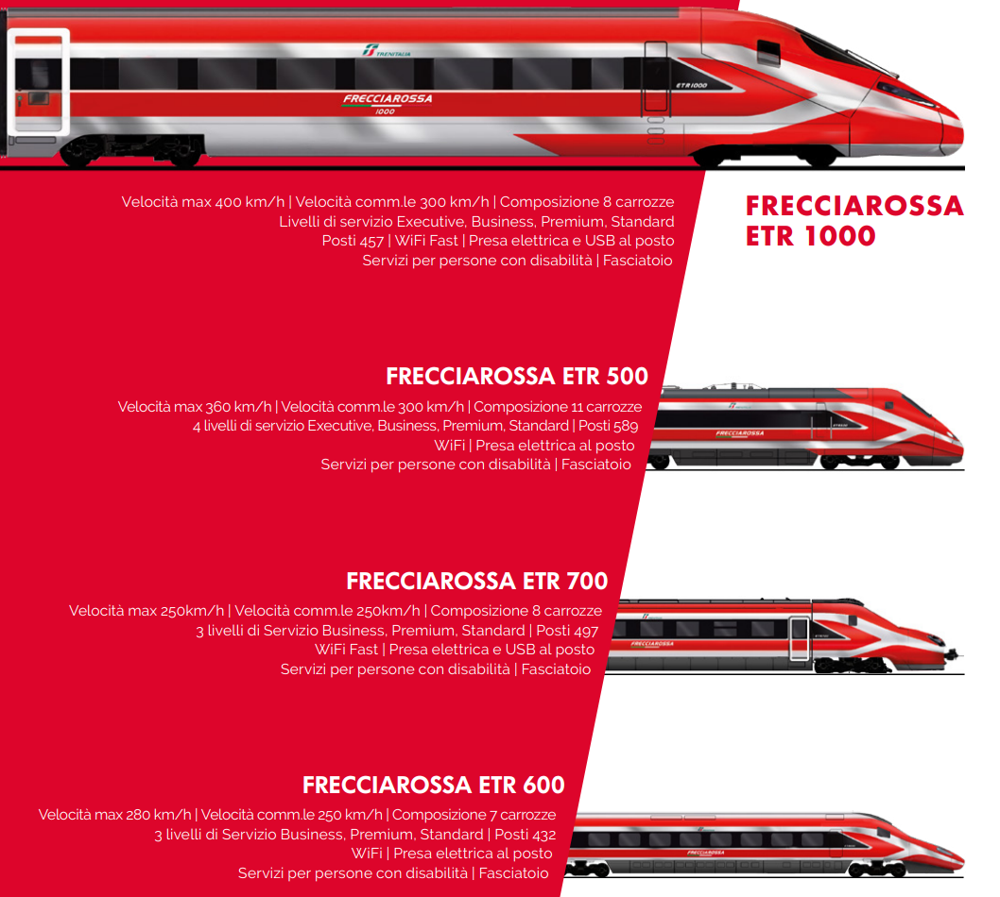
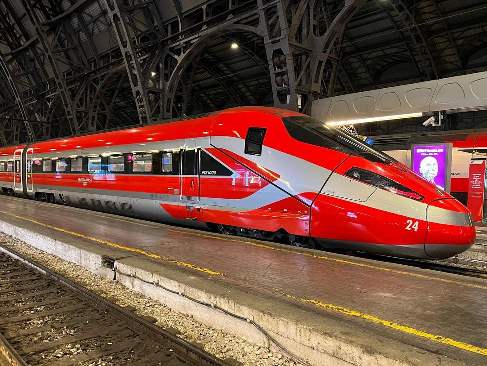
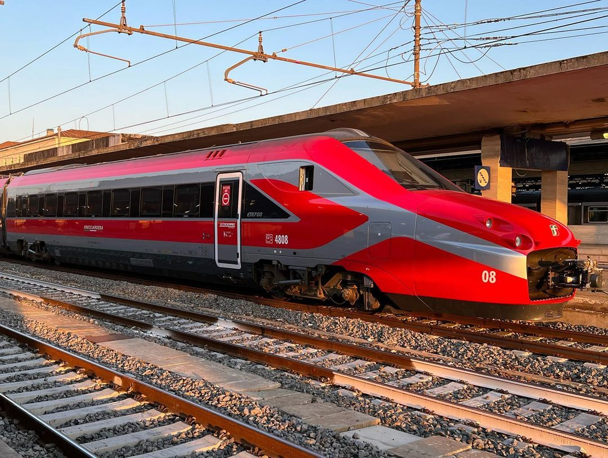
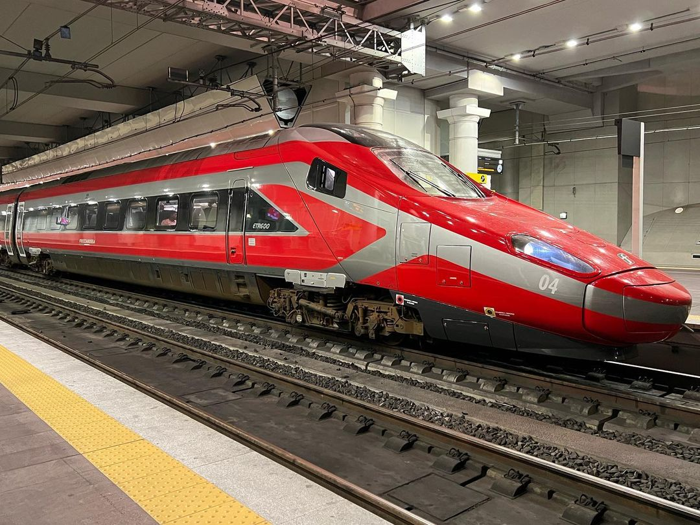
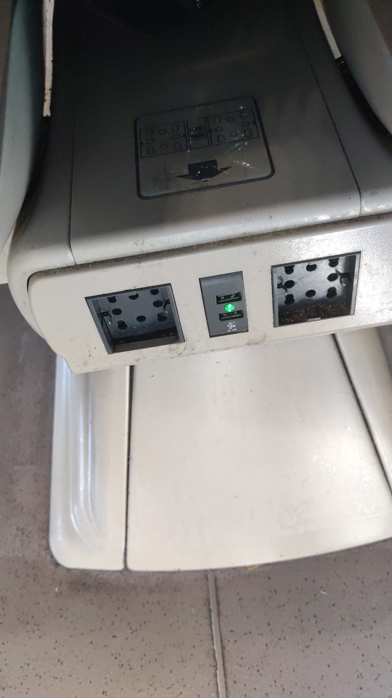
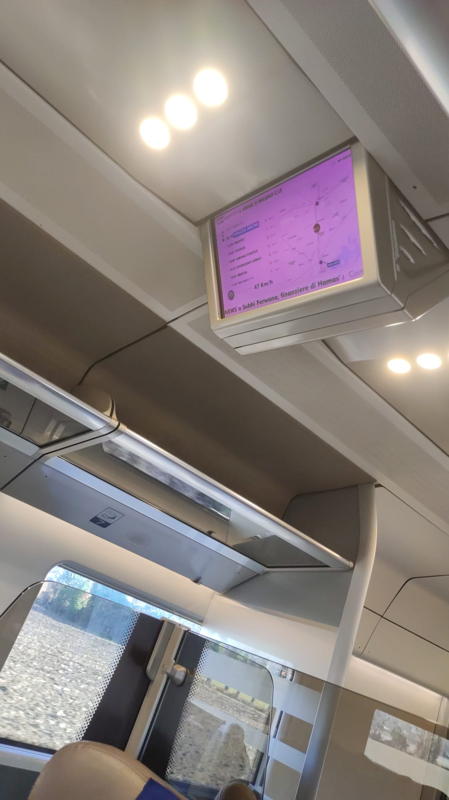

L'Italia, da lungo tempo pioniera nei treni ad alta velocità sin dai primi anni 50 con l'ETR.200, ha notevolmente segnato la sua presenza grazie al successo dei treni ETR.300 e ETR.250. Questi convogli, insieme ai rivoluzionari pendolini ETR.401 ed ETR.450 (degli anni 80), hanno modellato l'esperienza di viaggio ferroviario nel paese, contribuendo a consolidare il ruolo dell'Italia nel panorama ferroviario europeo. Non possiamo dimenticare anche il contributo di vari treni composti da carrozze TEE e Gran Confort, che hanno arricchito la diversità e la tradizione ferroviaria italiana, ormai relegati a servizi InterCity.

Le linee ad alta velocità, tra cui la storica Roma-Firenze, che purtroppo si sta congestionando a causa del traffico di treni regionali a 160 km/h, stanno vivendo un cambiamento che rende i treni ad alta velocità più lenti in favore di un trasporto interregionale più rapido, ma questo sembra che si risolverà con i regionali da 200 km/h, speriamo, hanno portato alla luce anche gli ETR.460 ed i ETR.470, quest'ultimi in servizio internazionale Italia-Svizzera, che sono i primi treni pendolanti di concezione moderna.

## La Decadenza dei Pendolini

Le linee più recenti, come la Firenze-Milano, hanno svolto un ruolo cruciale nella nascita degli ETR.500, il primo treno ad alta velocità in grado di raggiungere i 300 km/h, e degli ETR.485 ed ETR.600, i primi pendolini politensione. Quest'ultimo rappresenta l'ultimo baluardo della vera alta velocità italiana.

La decadenza dei Pendolini ha avuto inizio quando Trenitalia ha incontrato difficoltà nel reperire giroscopi sostitutivi per gli ETR.450 e ETR.460. Proprio per questo a partire dall'ETR.470, c'è stata la decisione di utilizzare giroscopi elettronici di più facile reperimento.

## Nuova Era Ferroviaria

L'impossibilità di aggiornare, senza cospiqui lavori i treni precedenti ha comportato la trasformazione di questi treni in convogli ordinari, senza il sistema di pendolamento, il che ha inevitabilmente portato ad un aumento dei tempi di percorrenza. Ma oggi, l'Italia si trova di fronte a una nuova era ferroviaria con la presenza degli ETR.400 e ETR.700, treni che stanno generando dibattiti e riflessioni sul futuro del trasporto ferroviario nel paese, decaduto proprio per il non voler adeguare i treni pendolini con il giroscopio analogico.

L'ETR.400, noto commercialmente come Frecciarossa 1000, fu presentato nel 2015 come se fosse il Grand Hotel su rotaia, destinato a conquistare i binari di tutta Europa. Tuttavia, poco dopo, fece la sua comparsa l'ETR.700, un treno dall'origine un po' peculiare: potrebbe essere definito un *rimasuglio* che ci è stato *rifilato* da AnsaldoBreda (ora parte di Hitachi). Inizialmente concepito per il servizio internazionale tra Olanda e Belgio, l'ETR.700 fu poi scartato per la bassa quanità costruttuiva del treno e la non formazione dei macchinisti.

Quest'ultimo modello fu presentato come un'alternativa conveniente all'ETR.400 in fase di costruzione. La proposta sosteneva che, anziché optare per l'acquisto di 10 ETR.400, sarebbe stato più vantaggioso acquistare i 19 ETR.700 fermi da anni negli stabilimenti, inoltre, c'era la promessa che con l'acquisto degli ETR.700 AnsaldoBreda avrebbe in parte ripianato il dissesto economico, garantendo che l'ETR.400, che in quel periodo era in fase di costruzione da una joint venture tra AnsaldoBreda e Bombardier, avrebbe avuto una costruzione più celere grazie proprio ai soldi dell'ETR.700. Per tutti questi motivi Trenitalia ha iniziato a considerare seriamente l'opzione degli ETR.700 come mezzo per accelerare l'arrivo dei Frecciarossa 1000, ed infatti sono arrivati, con forte ritardo, in quanto erano letteralmente pieni di problemi.

Il debutto dell'ETR.700 non è stato dei migliori fino al 2019: il treno usciva dagli stabilimenti AnsaldoBreda solo per rientrarvi poco dopo con una lista di problemi e correzioni da affrontare. Dopo un'attenta valutazione, soprattutto dal punto di vista tecnico e della sicurezza, Trenitalia ha stabilito che questi convogli, sebbene praticamente nuovi, rispondessero alle proprie esigenze. A partire dal 9 giugno 2019, hanno quindi iniziato il servizio commerciale (mentre gli ETR.400 avevano già iniziato il servizio molti anni prima, nel 2015).

Nonostante ciò, i passeggeri hanno segnalato un livello di comfort inferiore rispetto ad altri treni ad alta velocità (rispetto all'ETR.500 e ETR.600). In primo luogo, è l'unico treno di questa categoria con le porte posizionate negli intercomunicanti, senza alcun isolamento, e per di più, sprovviste di fotocellule, risultando fastidiose per gli utenti che rischiano di essere schiacciati. Successivamente, una serie di guasti ha colpito gli ETR.700, come documentato dalle cronache ferroviarie del 2019 e del 2020, che riportano numerosi episodi di malfunzionamenti e cancellazioni dei servizi associati a questi convogli.

## Comparazione Dimensioni e Comfort tra Modelli

Neanche l'ETR.400 si classifica tra i migliori treni prodotti, nonostante la sua larghezza di 10 cm superiore rispetto agli ETR.600/610/675:

- ETR.400 (Frecciarossa 1000): larghezza 2924 mm

- ETR.700: larghezza 2870 mm

- ETR.600/610/675: 2830 mm

La larghezza dei sedili è notevolmente ridotta:

| **Classe/Treno** | **ETR.400** | **ETR.500** | **ETR.600**  | **ETR.700**            |
| ---------------- | ----------- | ----------- | ------------ | ---------------------- |
| **EXECUTIVE**    | 60cm        | 69cm        | Non presente | Non presente           |
| **BUSINESS**     | 55cm        | 64cm        | 64cm         | come ETR.500 e ETR.600 |
| **PREMIUM**      | 46cm        | 55.5cm      | 52.5cm       | come ETR.500 e ETR.600 |
| **STANDARD**     | 46cm        | 55.5cm      | 52.5cm       | come ETR.500 e ETR.600 |

Questa scelta è stata in parte determinata dalla necessità di corridoi più larghi e fluidi per le persone diversamente abili, ma anche dall'elevato spessore della struttura portante del treno e dai relativi materiali isolanti non ottimali.

Il numero di passeggeri per carrozza è descritto nella tabella successiva:

| **Classe/Treno** | **ETR.400**                                                     | **ETR.500**                                                                                           | **ETR.600**                                                     | **ETR.700**                                                                     |
| ---------------- | --------------------------------------------------------------- | ----------------------------------------------------------------------------------------------------- | --------------------------------------------------------------- | ------------------------------------------------------------------------------- |
| **EXECUTIVE**    | Mezza carrozza, 10 poltrone                                     | Mezza carrozza, 8 poltrone                                                                            | Non presente                                                    | Non presente                                                                    |
| **BUSINESS**     | 2 carrozze e mezza carrozza, 50 posti + 23 nella mezza carrozza | 4 carrozze e 1/2, 52 posti (Carrozze 2, 3 e 4), 37 posti (Carrozze 5) + 16 posti nella mezza carrozza | 2 carrozze, 44 posti (Carrozza 1), 56 posti (Carrozza 2)        | 3 carrozze, 47 posti (Carrozza 1), 40 posti (Carrozza 2), 53 posti (Carrozza 3) |
| **PREMIUM**      | 1 carrozza, 76 posti                                            | 2 carrozza, 67 posti                                                                                  | 1 carrozza, 24 posti                                            | Mezza carrozza, 52 posti                                                        |
| **STANDARD**     | 3 carrozze, 80 posti (Carrozze 6 e 7) e 60 posti (Carrozza 8)   | 5 carrozze, 68 posti                                                                                  | 4 carrozze, 80 posti (Carrozze 4, 5 e 6), 66 posti (Carrozza 7) | 5 carrozze, 78 posti (Carrozza 5, 6 e 7), 66 posti (Carrozza 8)                 |
| Totale           | 457 posti in 8 carrozze                                         | 574 posti in 11 carrozze o 642 in 12 carrozze                                                         | 432 posti in 7 carrozze                                         | 497 posti in 8 carrozze                                                         |

Come si può notare, il Frecciarossa 1000, soprattutto a causa della notevole ristrettezza dei posti, e successivamente l'ETR.700, possono essere più appropriatamente definiti come carri bestiari ad alta velocità piuttosto che autentici treni ad alta velocità. Questa caratteristica li contrappone agli ETR.500, anche se questi ultimi sono notevolmente più datati, risalendo al 1990, e spesso mostrano segni di scarsa manutenzione. Nonostante ciò, anche l'ETR.400 (in una traccia assegnata a un ETR.700, chissà perché) presenta segni di scarsa manutenzione. Queste osservazioni sono state documentate attraverso scatti effettuati a metà dicembre 2023, provenienti dal treno 03.

## ETR.600: Ultimo Baluardo della Vera Alta Velocità, che speriamo non sia l'ultimo

D'altra parte, gli ETR.600, costruiti nel 2012, sono mantenuti in ottime condizioni e costituiscono gli ultimi treni dotati di un meccanismo di pendolamento. Questa caratteristica consente loro di raggiungere elevate velocità anche su linee tortuose, garantendo un'esperienza di viaggio avanzata e confortevole. Tuttavia, il loro numero è limitato a soli 12, di cui 11 sono effettivamente in servizio dopo l'incidente di Faenza, sperando che rientrerà in servizio il prima possibile.

Allo stesso modo, sembra che i servizi internazionali tra l'Italia e la Slovenia saranno gestiti dagli ETR.700. Questa decisione appare discutibile, soprattutto considerando che il territorio montuoso della Slovenia si adatta bene ai treni di tipo pendolino. Inoltre, la linea Venezia-Trieste permette velocità superiori rango P (cioè per i treni che pendolano) rispetto agli ETR.700. È fondamentale notare che i servizi ad alta velocità locali sono già svolti con i treni SŽ 310, una variante dell'ETR.460 italiano. Questo solleva il terzo campanello d'allarme sull'appropriato utilizzo degli ETR.700 in questa relazione.

La soluzione migliore, sarebbe di comprare nuovi treni pendolini basati sulla nuova piattaforma Tiltronix di Alstrom che unisce i carrelli nuovi ed adatti ai 400 km/h insieme allo stesso sistema di pendoloamento che Alstrom ha ereditato da Fiat Ferrovia ma senza utilizzare la vecchia piattaforma degli ETR.401/450/460/600/610, che quest'ultima che permette al massimo 280 km/h, in quanto è una eredità di alcune automotrici leggere, questi nuovi treni, con un allestimento interno migliore dell'ETR.400 potrebbe essere il vero treno AV da esportare in tutta europa, in quanto permette di risparmiare decine di minuti nelle linee con rango P e anche di sfruttare al massimo le linee ad alta velocità.

