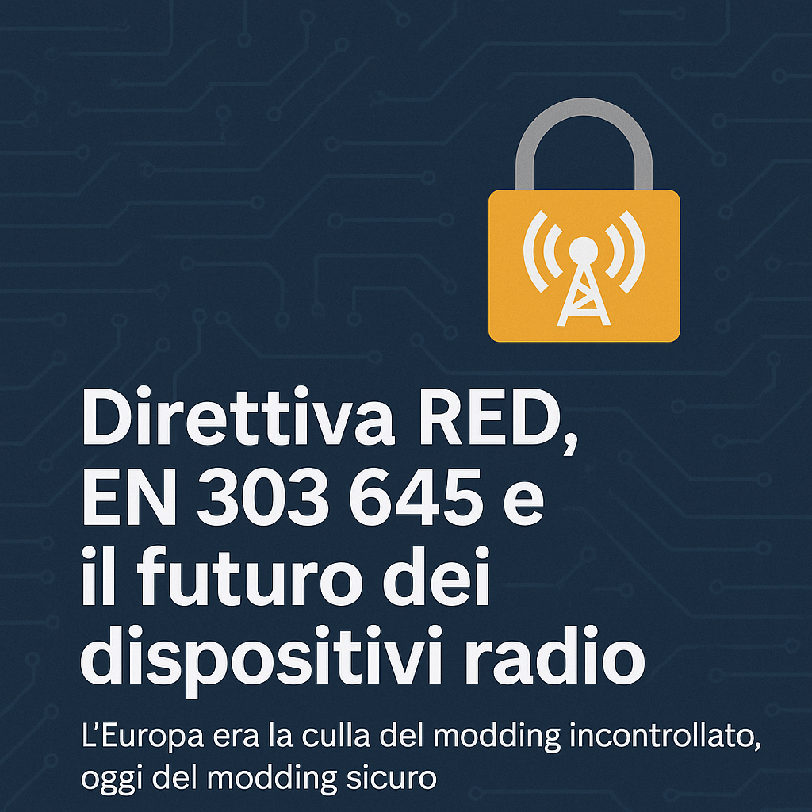
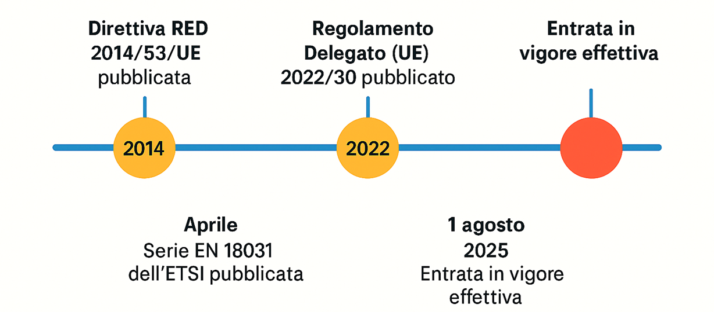

> Una rete più sicura, meno modificabile — ma non per forza meno libera: In breve:
> 
> 🇪🇺 La Direttiva RED e il Regolamento UE 2022/30 impongono nuovi requisiti di sicurezza per dispositivi radio (Wi-Fi, Bluetooth, LTE) venduti in Europa.
> 
> 🛡️ I produttori dovranno garantire che il firmware radio non sia modificabile per evitare abusi o interferenze.
> 
> 🖥️ Linux e firmware alternativi (OpenWrt, LineageOS) non sono vietati, ma l’hardware futuro sarà più blindato.
> 
> 🔐 Solo sistemi con Secure Boot attivo e kernel firmati avranno piena compatibilità.
> 
> ⚠️ Alcune distribuzioni libere (Arch, Gentoo, Alpine) potrebbero avere supporto limitato.
> 
> 🧩 L’impatto è minimo per gli utenti esperti, e il vantaggio è una rete più sicura e meno vulnerabile.
> 
> 🧯 Fine del ciarpame: la RED bloccherà la vendita di dispositivi IoT insicuri, con firmware scadente o configurazioni pericolose.
> 
> 📅 Applicazione effettiva: dal 1 agosto 2025 per tutti i dispositivi nuovi sul mercato UE.

Negli ultimi anni, l’Unione Europea ha deciso di affrontare di petto un problema spesso ignorato: la **sicurezza dei dispositivi radio e connessi**. Router, smartphone, notebook, smart home, giocattoli Wi-Fi: tutto ciò che trasmette o riceve segnali deve essere progettato per resistere a intrusioni, abusi, configurazioni pericolose.

Il punto centrale di questa nuova ondata normativa è la **Direttiva RED (2014/53/UE)**[^red_direttiva], affiancata dal **Regolamento Delegato UE 2022/30**[^red_regolamento] e dagli standard **EN 303 645**[^red_303_645] e **EN 18031**.

L’obiettivo? Costruire un ecosistema digitale più solido, dove i dispositivi non siano solo “intelligenti” ma anche **responsabili**.

Ma — come sempre — non è solo una questione tecnica. Le regole che rendono i dispositivi più sicuri possono anche ridurre la libertà di personalizzarli o modificarli. Questo ha generato perplessità, in particolare nella community Linux, tra sviluppatori, utenti avanzati, e progetti open source, come OpenWrt[^openwrt].

Cerchiamo allora di capire, con un po’ di ordine:  
- **cosa cambia** davvero con queste norme,  
- **quali sono i benefici**,  
- e quali sono gli impatti — concreti ma contenuti — per chi ama avere il controllo completo dei propri dispositivi.

## Cos’è la Direttiva RED?

La **Radio Equipment Directive**[^red_direttiva] stabilisce i requisiti essenziali per poter vendere in Europa qualsiasi dispositivo che utilizzi radiofrequenze (Wi-Fi, Bluetooth, LTE, Zigbee, ecc.).

Nel 2022, con il **Regolamento Delegato (UE) 2022/30**[^red_regolamento], l’UE ha reso vincolanti tre punti chiave:

- protezione da accessi non autorizzati;
- tutela della privacy;
- integrità delle reti.

Tutto questo entrerà pienamente in vigore il **1 agosto 2025**. Da quel momento, ogni dispositivo radio venduto in Europa dovrà dimostrare di essere “cybersecure”.

## Perché il firmware radio deve essere regolato

Un punto che spesso viene trascurato — anche da chi si considera esperto — è che il funzionamento della radiofrequenza **non è un affare privato**.

Quando un dispositivo trasmette su una frequenza sbagliata, o con potenza superiore ai limiti legali, **non danneggia solo se stesso**, ma può creare **interferenze su altri dispositivi**, disturbare reti altrui, o addirittura interferire con apparecchiature sensibili (pensiamo ai sistemi in banda ISM, alle reti mesh condominiali o a strumenti medicali wireless).

Eppure è pieno di guide online e video su YouTube che consigliano — senza alcuna consapevolezza normativa o tecnica — di:
- **aumentare la potenza del Wi-Fi** tramite parametri da CLI;
- **forzare canali DFS** non permessi nella propria regione;
- **modificare il paese (“regdomain”)** del dispositivo per bypassare le restrizioni.

Tutte queste operazioni, spesso presentate come "tweak da smanettoni", possono **violare regolamenti radio**, generare **disturbi locali**, e in alcuni casi rendere il dispositivo **fuorilegge**.  
Il fatto che vengano eseguite da utenti che si definiscono esperti non le rende meno pericolose.

Ecco perché la RED, pur lasciando libertà al software, richiede che **il firmware radio sia firmato, verificato e gestito tramite una catena sicura**. È buonsenso — tecnico e regolatorio.

## Gli standard: EN 303 645 e EN 18031

Per aiutare i produttori a rispettare la normativa, gli enti di normalizzazione europei hanno definito due nuovi standard:

- **EN 303 645**: una lista di pratiche di sicurezza per dispositivi IoT, per evitare le classiche backdoor di debug comunemente presenti, poco rispettata diffusa.
- **EN 18031**: una nuova serie che serve come riferimento tecnico per dimostrare la conformità alla RED.

In parole povere, si tratta di **evitare password predefinite**, garantire **aggiornamenti firmati** e controllati, limitare l’**esposizione di servizi di rete**, e assicurarsi che l’hardware radio non possa essere usato impropriamente.

## Modifiche, firmware e libertà utente: cosa cambia davvero?

La preoccupazione più comune è che queste normative blocchino la possibilità di installare firmware alternativi come **OpenWrt** o **LineageOS**, o che limitino drasticamente l’uso di **Linux** su PC.

Il punto è più sfumato.

La RED **non vieta Linux**, né i firmware open source. Ma richiede che il produttore del dispositivo garantisca che **le componenti radio non possano essere alterate liberamente**, per evitare abusi o danni a terzi. Attualmente i produttori di pc già validano tramite il BIOS le schede wifi installate e il loro firmware, e molto probabilmente verrà rafforzata la protezione di questa parte non vietato Linux.

### Cosa cambia per router, smartphone e PC?

- **Firmware radio**: dovranno essere firmati, controllati, non modificabili. Non per limitare il modding, ma per evitare che l’utente (anche se esperto) possa, ad esempio, aumentare la potenza Wi-Fi o usare frequenze vietate.
- **Bootloader**: alcuni produttori (come Samsung[^dday]) stanno iniziando a bloccare lo sblocco del bootloader per garantire la sicurezza della piattaforma e poter rispettare la direttiva[^samsung].
- **Driver open source**: potrebbero ridursi, perché i produttori preferiranno rilasciare driver chiusi e certificati, garantendo così la conformità automatica.
- **UART e accessi fisici**: le interfacce seriali e debug dovranno essere disattivate o protette.

Ma attenzione: **questo impatta soprattutto i nuovi dispositivi venduti dopo il 1° agosto 2025**.  
Chi usa oggi un router con OpenWrt o un portatile con Arch Linux non dovrà cambiare nulla.

### E Linux? Che succede alle distribuzioni libere?

Qui serve una distinzione importante.

La RED non impone vincoli diretti a chi sviluppa Linux. Il problema nasce indirettamente, si potranno individutare due tipi di componenti radio, i primi blindati, senza possibilità di aggiornamenti di firmware, ed i secondi che richiedereanno un ambiente "trusted", allora **solo alcune distribuzioni** — quelle con Secure Boot attivo, kernel firmati, e supporto enterprise — potranno offrire compatibilità nativa.

In pratica:

- **Ubuntu, Red Hat, SUSE** continueranno a funzionare.
- **Arch, Gentoo, Void, Alpine**, dovranno usare componenti radio blindati, oppure accettare un supporto parziale oppure usare device immessi sul mercato prima del 1° agosto 2025.

Ma anche in questo caso, non si tratta di esclusione ideologica: si tratta di **garantire che i firmware radio non siano alterati**, una richiesta sensata in un’epoca di reti affollate e rischi diffusi. La gestione dei firmware dei chip Radio non può più essere lasciata alla buona volontà di chi guarda un tutorial su YouTube e poi ‘boosta’ la trasmissione Wi-Fi.

## Perché serve tutto questo?

Perché il panorama attuale è spesso disastroso.

Sono in vendita milioni di dispositivi IoT con firmware scadenti: prese smart con vulnerabilità note, telecamere IP con telnet aperto, speaker Wi-Fi con software cinese riciclato. Alcuni di questi oggetti sono in grado di:

- saturare la rete Wi-Fi di casa;
- generare traffico anomalo;
- finire in botnet tipo **Mirai**, usate per attacchi DDoS.

Mettere un limite a questo tipo di prodotti è **giusto e necessario**.

La RED serve a **tenere fuori dal mercato europeo il ciarpame tecnologico** — ed è un passo avanti.  
Pretende responsabilità da chi vende, non solo da chi compra.

## È davvero la fine del modding?

No. Ma sarà un mondo **leggermente più controllato**, dove:

- solo i firmware radio firmati e verificabili saranno accettati;
- i dispositivi avranno catene di avvio più protette;
- alcune modifiche saranno più complesse, ma non impossibili.

Gli utenti esperti potranno ancora usare OpenWrt, installare Arch, modificare device.  
Ma dovranno farlo in modo più consapevole, e talvolta su hardware progettato per permetterlo.

E tutto questo è, in fondo, un compromesso ragionevole:  
non possiamo più permettere che la libertà personale coincida con la possibilità di **compromettere la sicurezza altrui**.

## Fraintendimenti comuni

C'è molta confusione online su cosa comporterà davvero l'applicazione della Direttiva RED e del Regolamento 2022/30. Vale la pena chiarire alcuni punti fondamentali:

- ❌ **In America non ci sono questi vincoli** → **Falso**. In America le normative sono più stringenti, e normative simili alla RED esistono già da anni.

- ❌ **La RED vieta Linux** → **Falso**. Linux, così come qualsiasi altro sistema operativo, può continuare ad essere usato. La RED si applica **ai dispositivi** e in particolare ai **moduli radio**, non ai sistemi operativi.

- ❌ **OpenWrt sarà illegale** → **Falso**. Nessuna normativa vieta i firmware alternativi. Sarà però responsabilità del produttore garantire che l’uso di firmware modificati **non comprometta la sicurezza radio**, ad esempio tramite l’uso di componenti separati o firmware radio firmati.

- ❌ **Non si potranno più aggiornare i dispositivi** → **Falso**. Gli aggiornamenti continueranno a esistere, ma in modo più sicuro: **firmati, autenticati, provenienti da fonti affidabili**. Questo non impedisce modifiche, ma le rende più strutturate e meno improvvisate.

Come spesso accade, **non è la tecnologia a cambiare**, ma il modo in cui la gestiamo — con più attenzione alle conseguenze.

## Conclusione

La direttiva RED e il Regolamento 2022/30 sono un cambiamento importante.  
Portano con sé vincoli, è vero, ma anche maggiore trasparenza, aggiornamenti sicuri, meno dispositivi vulnerabili e meno improvvisazione.

Chi è abituato ad avere pieno controllo sui dispositivi dovrà adattarsi, ma **non è l’apocalisse del software libero**.

È un’occasione per costruire un ecosistema più sano, dove la sicurezza **non è più un’opzione**, ma parte integrante del design.

E in fondo, se tutto questo significa meno router con *admin/admin* e meno prese smart zombie sulla rete...  
...forse ne vale la pena.

📚 **Fonti e approfondimenti**  
[^red_direttiva]: [Direttiva RED 2014/53/EU](https://eur-lex.europa.eu/legal-content/EN/TXT/?uri=CELEX:32014L0053)  
[^red_regolamento]: [Regolamento Delegato UE 2022/30](https://eur-lex.europa.eu/legal-content/EN/TXT/?uri=CELEX:32022R0030)  
[^red_303_645]: [ETSI EN 303 645 – Cybersecurity for Consumer IoT](https://www.etsi.org/technologies/cyber-security)  
[^openwrt]: [OpenWrt – Discussione su RED](https://forum.openwrt.org/t/red-radio-equipment-directive-2014-53-eu-long-term-strategy-for-europe/101145)  
[^ilsoftware]: [IlSoftware – Firmware alternativi a rischio](https://www.ilsoftware.it/Una-direttiva-europea-potrebbe-impedire-l-utilizzo-di-OpenWrt-DD-WRT-e-degli-altri-firmware-non-ufficiali_23291/)  
[^samsung]: [Samsung Electronics ottiene la certificazione EU RED](https://news.samsung.com/it/samsung-electronics-ottiene-la-certificazione-eu-red)
[^dday]: [La fine delle custom ROM e dei bootloader sbloccati in Europa. Samsung la prima, gli altri seguiranno](https://www.dday.it/redazione/53894/la-fine-delle-custom-rom-e-dei-bootloader-sbloccati-in-europa-samsung-la-prima-gli-altri-seguiranno)
