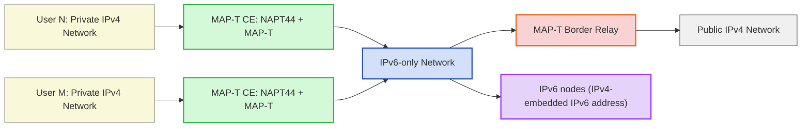
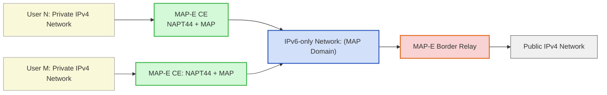
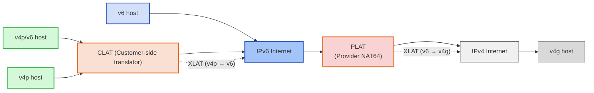
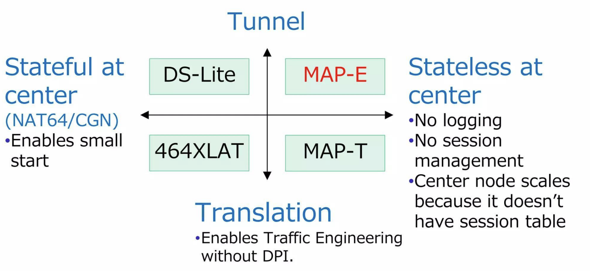

# CGNAT, MAP-T e MAP-E spiegati con le codifiche di caratteri

Negli ultimi anni, con l'esaurimento degli IPv4, gli operatori hanno iniziato a usare tecniche sempre più sofisticate per far convivere vecchio e nuovo Internet.

Quando si parla di esaurimento IPv4, spesso la narrativa è troppo semplificata: "attiviamo IPv6 e il problema sparisce".
Chi lavora davvero nelle reti sa che la realtà è molto più complessa.

Il problema è noto: gli indirizzi IPv4 non bastano più, ma gran parte della rete mondiale continua a dipendere da IPv4.

Per gestire questa transizione sono nate diverse soluzioni:

- Dual Stack
- CGNAT
- MAP-T
- MAP-E

Sulla carta sembrano varianti dello stesso concetto. In realtà incarnano filosofie molto diverse.

Un modo sorprendentemente efficace per capirle è guardarle attraverso un'analogia con le codifiche di caratteri: ISO-8859-1, UTF-8 e UTF-16.

Molti sviluppatori più giovani danno per scontato che "tutto sia UTF-8".
Molti sistemi legacy — e chi ci ha lavorato per anni — continuano invece a ragionare come se il mondo fosse ancora ASCII o ISO-8859-1 (spesso chiamato impropriamente "ANSI").

## Due parole sugli encoding (per chi se li è dimenticati)

Un encoding di caratteri risponde sempre alla stessa domanda:

> come rappresento più simboli possibili usando meno spazio possibile, senza rompere la compatibilità?

Nel tempo abbiamo visto approcci molto diversi:

- ASCII: semplice ma limitato
- ISO-8859-1: estensione locale
- UTF-16: più pulito ma con overhead
- UTF-8: efficiente e scalabile
- UTF-32: perfetto ma costoso

Nella seguente tabella vediamo la rappresentazione di alcuni caratteri con i vari encoding:

| Encoding     | A      | b      | à        | ß        | 漢            | 字            | 😂                      |
|--------------|--------|--------|----------|----------|---------------|---------------|------------------------|
| ASCII        | 0x41   | 0x62   | —        | —        | —             | —             | —                      |
| ISO-8859-1   | 0x41   | 0x62   | 0xE0     | 0xDF     | —             | —             | —                      |
| UTF-16       | 0x0041 | 0x0062 | 0x00E0   | 0x00DF   | 0x6F22        | 0x5B57        | 0xD83D 0xDE02          |
| UTF-8        | 0x41   | 0x62   | 0xC3 0xA0| 0xC3 0x9F| 0xE6 0xBC 0xA2| 0xE5 0xAD 0x97| 0xF0 0x9F 0x98 0x82    |

Le transizioni IPv6 raccontano esattamente la stessa storia.

### ASCII: l'origine di tutto

ASCII nasce negli anni '60 con un obiettivo molto chiaro: rappresentare caratteri inglesi usando 7 bit. Questo significa un massimo di 128 simboli.

Funziona benissimo… finché si resta nell'inglese puro.

Il problema emerge subito appena si esce da quel perimetro: niente accenti, niente caratteri europei, niente simboli avanzati. È efficiente, semplicissimo da processare, ma rigidamente limitato.

Ed è proprio questa rigidità che lo rende un buon parallelo mentale per capire perché certe soluzioni tecniche, pur eleganti, non scalano.

### IPv4

Proprio in analogia all'ASCII, IPv4 nasce nel 1980 con un obiettivo molto chiaro: fare esperimenti in ARPANET, non per la moderna internet.

### ISO-8859-1: la toppa europea, che funziona… finché basta

Per risolvere i limiti di ASCII, negli anni '80 arriva ISO-8859-1.
L'idea è semplice: passare da 7 a 8 bit, arrivando a 256 simboli.

Per l'Europa occidentale funziona decentemente.
Per il resto del mondo… molto meno.

ISO-8859-1 rimane:

- semplice
- compatibile con molti sistemi legacy
- facile da implementare

ma strutturalmente limitato e non universalmente scalabile. Ed è esattamente qui che entra in gioco il parallelo con CGNAT.

### CGNAT è come ISO-8859-1

Il CGNAT è la soluzione più immediata al problema IPv4: pochi indirizzi pubblici, molti utenti dietro NAT.

Funziona. Sempre. Subito.

Ma con un limite strutturale evidente: lo spazio è finito.

IPv4 sono 32 bit.
ISO-8859-1 sono 8 bit.

Stesso problema, scala diversa.

Nel breve periodo regge.
Nel lungo periodo accumula problemi:

- stato centralizzato
- complessità operativa lato ISP
- problemi con il port forwarding
- tracciabilità più complicata
- scalabilità costosa

Proprio come ISO-8859-1, è una soluzione che nasce per tamponare, non per durare.

### UTF-8: la soluzione che ha vinto

UTF-8 cambia completamente approccio.

Non usa lunghezza fissa.
Adatta lo spazio al contenuto.

ASCII resta a 1 byte.
Il resto cresce solo quando serve.

Il risultato è quello che conosciamo:

- perfetta retrocompatibilità con ASCII
- ottima efficienza per il traffico reale
- scalabilità globale
- parsing relativamente semplice

È per questo che UTF-8 ha conquistato il web.

Ed è anche per questo che il parallelo con MAP-T regge così bene: entrambi spostano complessità dove serve davvero e mantengono il core più pulito e scalabile.

### MAP-T è come UTF-8

MAP-T[^RFC7599] è una delle soluzioni più eleganti dal punto di vista ingegneristico, e segue una filosofia molto simile. Fa una cosa semplice ma potente: elimina lo stato nel core. Si mappa un sottoinsieme di indirizzi IPv4 in IPv6 e si fa una traduzione degli IP, proprio come in UTF-8, si usa una codifica che permette di esprimere tutti i \(2^20\) caratteri in modo scalare, i più usati in 8 bit, poi altri a 16, 24 e infine a 32 bit con le surrogate pairs.

Invece di mantenere un grande stato nel core di rete, MAP-T sposta l'intelligenza verso i bordi e usa una traduzione stateless tra IPv4 e IPv6. Questo riduce drasticamente la complessità operativa dell'ISP e migliora la scalabilità.

I vantaggi sono evidenti:

- core di rete più semplice, IPv6 only
- migliore scalabilità
- meno stato centralizzato

Non è perfetto: supporta solo TCP, UDP e ICMP, non altri protocolli come GRE, un po' come UTF-8 che non supporta la codifica a 8 bit dei caratteri latin 1.

Come UTF-8, MAP-T non è la soluzione più "pura" dal punto di vista teorico, ma è quella che nella pratica tende a funzionare meglio nella maggior parte degli scenari.

Non a caso molti operatori lo preferiscono per deployment su larga scala[^ipv6_case_studies][^SkyIT-1][^SkyIT-2][^SkyUK].

### UTF-16: un compromesso diverso

UTF-16 adotta un approccio ancora differente: usa unità da 16 bit, con meccanismi aggiuntivi (surrogate pair) per i caratteri fuori dal Basic Multilingual Plane.

Non è inefficiente in assoluto — in certi contesti è anzi molto competitivo — ma introduce un diverso profilo di trade-off:

- maggiore prevedibilità sulla lunghezza
- ma più overhead medio rispetto a UTF-8 sul traffico web
- gestione leggermente più complessa in alcuni casi

C'è anche un altro aspetto spesso ignorato quando si parla di UTF-16: nel mondo reale, soprattutto in ambiente Windows, è ancora estremamente diffuso e ben supportato.

Lo stack Win32, le API di sistema moderne e gran parte dell'ecosistema .NET lavorano internamente in UTF-16. Questo significa che, su queste piattaforme, UTF-16 non è affatto una scelta esotica o inefficiente: è spesso la rappresentazione più naturale dei dati testuali.

Dal punto di vista statistico, inoltre, UTF-16 ha un comportamento interessante. La stragrande maggioranza dei caratteri usati quotidianamente (in particolare quelli del Basic Multilingual Plane, quindi anche le lingue orientali) rientra in un singolo code unit da 16 bit, e solamente le estensioni di ideogrammi e le emoji sforano la singola code unit UTF-16. I caratteri che richiedono surrogate pair — quindi due code unit — esistono, ma nel traffico tipico sono relativamente rari.

In pratica:

- la lunghezza dei caratteri è più prevedibile rispetto a UTF-8
- molte operazioni di indicizzazione risultano più semplici
- in ambienti dominati dal BMP, l'overhead è contenuto

Questo non significa che UTF-16 sia "migliore" di UTF-8 in assoluto — soprattutto sul web UTF-8 resta generalmente più efficiente — ma rafforza l'idea centrale: ogni scelta è un trade-off legato al contesto operativo.

Ed è esattamente lo stesso motivo per cui MAP-E, pur non essendo sempre la soluzione più efficiente in senso generale, rimane perfettamente sensato in specifiche architetture di rete.

### MAP-E ricorda UTF-16

UTF-16 non è sbagliato — anzi, in certi contesti è molto efficiente — ma introduce un trade-off diverso rispetto a UTF-8.

MAP-E[^RFC7597] si colloca in una posizione simile.

Invece della traduzione, MAP-E usa l'incapsulamento IPv4-in-IPv6. Questo evita alcune complessità della traduzione stateless, ma introduce overhead di tunneling e un diverso profilo prestazionale.

I punti chiave sono:

- meno manipolazione dei pacchetti
- ma più overhead di incapsulamento
- comportamento diverso sotto carico
- trade-off più situazionale
- supporto a qualsiasi protocollo over IP, non solo ICMP, UDP e TCP

Come UTF-16, può essere perfettamente sensato in certi ambienti, ma non è sempre la scelta più efficiente in termini generali. Il fatto che MAP-E supporti qualsiasi protocollo over IP, non solo ICMP, UDP e TCP, ricorda tanto che in UTF-16 la stragrande maggioranza dei caratteri usati quotidianamente (in particolare quelli del Basic Multilingual Plane, quindi anche le lingue orientali) rientra in un singolo code unit da 16 bit, e solamente le estensioni di ideogrammi e le emoji sforano la singola code unit UTF-16.

### UTF-32: l'approccio ideale ma costoso

UTF-32 è l'approccio ideale ma il più costoso per rappresentare i caratteri. Dato che lo standard Unicode prevede \(2^20\) caratteri, essi sono codificabili in 20 bit, quindi usare uno spazio di codifica a 32 bit sarebbe l'ideale; peccato che sia realmente costoso — un overhead peggio del base64.

### Dual-stack nativo: la soluzione ideale (ma costosa)

Il dual-stack puro è la soluzione concettualmente più pulita. La rete trasporta nativamente sia IPv4 sia IPv6, senza tunnel né traduzioni.

Dal punto di vista architetturale è quasi perfetto: niente encapsulation, niente NAT aggiuntivi, debugging relativamente lineare. È anche il modello che meglio preserva l'end-to-end originario di Internet.

Il problema è operativo ed economico. Gestire due stack completi significa:

- doppio piano di indirizzamento
- doppia gestione routing
- doppia superficie di troubleshooting
- consumo continuo di IPv4 pubblici

Finché gli IPv4 costavano poco era sostenibile. Oggi, su larga scala residenziale, per molti operatori non lo è più. Ricorda proprio UTF-32: una soluzione ideale ma troppo costosa.

### DS-Lite e Lw4o6

DS-Lite[^RFC6333] introduce un tunnel IPv4 dentro IPv6, ma mantiene un CGNAT lato operatore.

È una via di mezzo tra incapsulamento e NAT centralizzato.

Il parallelo più vicino è un UTF-16 senza surrogate pairs, un po' come quello del vecchio cmd rimosso da Windows 10:

- hai una struttura moderna
- ma sei ancora vincolato a limiti legacy

Funziona, ma non scala elegantemente.

```mermaid
flowchart LR
    U["Utente IPv4 Privato"] -->|"Pacchetto IPv4"| CPE["CPE/Router DS-Lite"]
    CPE -->|"Incapsula IPv4 in IPv6"| ISP6["Rete IPv6 dell'ISP"]
    ISP6 -->|"Arriva all'AFTR"| AFTR["AFTR (Decapsula + CGNAT)"]
    AFTR -->|"IPv4 pubblica verso Internet"| INTERNET["Internet IPv4"]

    %% Frecce di ritorno
    INTERNET -->|"Risposta IPv4"| AFTR
    AFTR -->|"Incapsula IPv4 in IPv6"| ISP6
    ISP6 -->|"Decapsula"| CPE
    CPE -->|"Pacchetto IPv4"| U

    style U fill:#f9f9d9,stroke:#999,stroke-width:1px
    style CPE fill:#d3f9d8,stroke:#3bb54a,stroke-width:2px
    style ISP6 fill:#d3e0f9,stroke:#2a52be,stroke-width:2px
    style AFTR fill:#f9d3d3,stroke:#e36414,stroke-width:2px
    style INTERNET fill:#f0f0f0,stroke:#555,stroke-width:1px
```

Lw4o6[^RFC7596][^Lw4o6] è un'estensione dell'architettura DS-Lite che sposta la funzione NAPT44 al tunnel client IPv4/IPv6 situato nel CPE. È
L'architettura Lw4o6 è composta da due componenti: 
- lw4o6: Lightweight Basic Bridging BroadBand
- lwAFTR: Lightweight Address Family Transition Router.

In DS-Lite, NAPT44[^RFC3022] si concentra sull'AFTR. Questa funzione si basa interamente sul mantenimento dello stato (stato per flusso). NAPT44 può anche eseguire funzioni di registrazione per le connessioni in uscita dell'ISP (in alcuni paesi la registrazione delle connessioni è un requisito legale). Lw4o6 fornisce una soluzione al problema di DS-Lite (elevata capacità di elaborazione richiesta per CGNAT e registrazione) distribuendo NAPT44 ai CPE. Pertanto, la quantità di informazioni sullo stato in lwAFTR è significativamente ridotta, poiché non si basa più su un modello per flusso ma su un modello per abbonato (riduzione significativa dell'utilizzo di memoria e CPU da parte di lwAFTR). In altre parole, lwAFTR non richiede più CGNAT.

### Dove hanno davvero senso: fisso vs mobile

Finora abbiamo usato l'analogia con gli encoding per capire la filosofia delle varie tecniche.
Ma nella pratica operativa la domanda che conta è molto più concreta:

> dove conviene usare cosa?

La risposta cambia radicalmente tra rete fissa e rete mobile, perché cambiano i vincoli fondamentali.

Nelle reti fisse il collo di bottiglia è quasi sempre l'indirizzamento e la semplicità operativa.
Nelle reti mobili, invece, dominano mobilità, batteria, latenza e scala massiva.

Ed è qui che alcune tecnologie brillano… mentre altre diventano rapidamente problematiche.

### Reti fisse (FTTH, FWA, xDSL)

Nel fisso hai tre grandi vantaggi strutturali:

- CPE relativamente potente
- topologia stabile
- meno vincoli energetici

Questo permette di utilizzare senza problemi Dual-stack, CGNAT, MAP-T, MAP-E e DS-Lite.

### Reti mobili

Qui il mondo cambia completamente.

Vincoli dominanti:

- milioni di device
- mobilità continua
- consumo batteria
- necessità di handover veloci
- controllo stretto dello stato

Ed è per questo che alcune tecnologie, perfette nel fisso, diventano scomode nel mobile.

### NAT64 e 464XLAT: il mondo mobile

Nel mobile il problema cambia completamente[^cellular_networks].

NAT64 è più intelligente: fa da ponte tra due mondi diversi. Elimina completamente IPv4 nella rete core e traduce dinamicamente tra IPv6 e IPv4 in uscita dalla rete dell'ISP. A livello teorico è ottimo, ma ha un grosso problema: le app che usano IPv4 only.

Non serve "compatibilità elegante".
Serve scalabilità massiva.

Qui entrano in gioco NAT64 e 464XLAT.

NAT64 è come un runtime che converte tutto al volo:

- il mondo IPv6 parla con IPv4
- la traduzione è centralizzata

Ma da solo non basta.

Ed è qui che arriva 464XLAT.

464XLAT[^RFC6877] è un NAT64/DNS64 dove la conversione viene fatta sia tra CPE/Telefono e rete dell'ISP sia in uscita della rete dell'ISP. Questo permette di essere molto simile a livello di funzionamento a MAP-T.

464XLAT fa doppia conversione:

- lato client
- lato rete

È esattamente quello che succede nel mondo reale con Windows, internamente UTF-16, poi conversione verso UTF-8 per il web e nel salvataggio dei file. Nel mobile moderno, 464XLAT è diventato lo standard de facto.

Motivi tecnici molto concreti:

- core IPv6-only, come MAP-T e MAP-E
- niente IPv4 pubblico per device
- compatibilità con app legacy
- ottima scalabilità
- comportamento prevedibile in roaming

Android lo supporta nativamente da anni, e questo ha fatto la differenza.

È, realisticamente, la soluzione più pragmatica per reti cellulari di massa.

## Dove ha senso usare cosa

Nel fisso, dove hai CPE potenti e topologie stabili, puoi permetterti soluzioni più sofisticate:

- MAP-T
- MAP-E
- Dual-stack (se puoi permettertelo)

Nel mobile invece vincono le soluzioni pragmatiche:

- NAT64
- 464XLAT

Perché scalano meglio e richiedono meno stato distribuito. Riassumiamo infine le caratteristiche[^apnic46][^apricot2015]:

| Feature | 6RD | Softwires v2 | NAT444 | DS-Lite | Lw4o6 | NAT64 | 464XLAT | MAP-E | MAP-T |
|---------|-----|--------------|--------|---------|-------|-------|---------|-------|-------|
| Tunnel / Translation | T 6in4 | T (4in6/6in4) | X | T 4in6 | T 4in6 | X | X | T 4in6 | Translation |
| Dual-stack LAN | YES | YES | optional | YES | YES | NO | YES | YES | YES |
| IPv4 Multicast | YES | YES | limited | NO | NO | NO | NO | NO | NO |
| Access Network | IPv4 | IPv4 | IPv4 / dual | IPv6 | IPv6 | IPv6 | IPv6 | IPv6 | IPv6 |
| Overhead | ~20 bytes | ~40 bytes | - | 40 bytes | 40 bytes | - | ~20 bytes | 40 bytes | ~20 bytes |
| Impact in IPv6 addressing plan | YES | NO | NO | NO | NO | NO | NO | YES | YES |
| CPE Update | YES | YES | optional | YES | YES | YES | YES | YES | YES |
| NAT44/NAPT | CPE | CPE | CPE + CGN | CGN | CPE | CPE | CPE + ISP | CPE | CPE |
| 46/64 Translation | - | - | - | - | - | ISP | ISP + CPE | - | CPE + ISP |
| Translation at ISP (state) | - | - | with | with | - | with | with | w/o | w/o |
| Scalability | High | Medium | Medium | Medium | High | High | High | High | High |
| Performance | High | Low | Low | Low | High | Medium | High | High | High |
| ALGs | NO | NO | YES | YES | NO | YES | YES | YES | YES |
| Protocol support (not only TCP/UDP/ICMP) | YES | YES | YES | YES | YES | NO | NO | YES | NO |
| Sharing IPv4 Ports | NO | NO | YES | YES | YES | NO | NO | YES | YES |
| IPv6 Aggregation | NO | NO | optional | YES | YES | YES | YES | YES | YES |
| IPv4 Mesh | YES | YES | YES | NO | NO | NO | NO | YES | YES |
| IPv6 Mesh | YES | NO | optional | YES | YES | YES | YES | YES | YES |
| Impacts on logging | NO | NO | YES | YES | NO | YES | YES | NO | NO |
| HA simplicity | High | Low | Low | Low | High | Medium | High | High | High |
| DPI simplicity | Low | Low | High | Low | Low | High | High | High | High |
| Support in cellular | NO | NO | YES | NO | NO | YES | YES | NO | NO |
| Support in CPEs | YES | YES | YES | YES | YES | YES | YES | YES | YES |

## Conclusione

Le tecniche di transizione IPv6 non sono solo soluzioni tecniche.

Sono scelte architetturali.

E come tutte le scelte architetturali, sono trade-off.

L'analogia con gli encoding aiuta a vedere una cosa fondamentale:

> non esiste la soluzione perfetta, esiste la soluzione più adatta al contesto

- CGNAT è una toppa.
- MAP-T è l'evoluzione pragmatica.
- MAP-E è un compromesso diverso.
- Dual-stack è l'ideale irraggiungibile.
- 464XLAT è la realtà del mobile.

E proprio come negli encoding, alla fine vince chi trova il miglior equilibrio tra efficienza, compatibilità e complessità.

[^apnic46]: [APNIC 46 Training — *IPv6 Transition and IPv6-Only*](https://bgp4all.com/pfs/_media/training/apnic46/ipv6-trans-and-ipv6-only_v10.pdf)
[^apricot2015]: [Akira Nakagawa — *IPv6 Transition Technologies*, presentazione APRICOT 2015](https://www.slideshare.net/slideshow/3-20150304apricot2015fukuokaakira-1425344708/45873211)
[^ipv6_case_studies]: [RapidSeedbox — *IPv6 Case Studies*](https://www.rapidseedbox.com/blog/ipv6-case-studies)
[^cellular_networks]: [*IPv6 in Cellular Networks*](https://www.slideshare.net/slideshow/ipv6-in-cellular-networks/79787780)
[^RFC3022]: [Traditional IP Network Address Translator (Traditional NAT)](https://datatracker.ietf.org/doc/html/rfc3022)
[^RFC7599]: [Mapping of Address and Port using Translation (MAP-T)](https://datatracker.ietf.org/doc/html/rfc7599)
[^RFC7597]: [Mapping of Address and Port with Encapsulation (MAP-E)](https://datatracker.ietf.org/doc/html/rfc7597)
[^RFC6877]: [464XLAT: Combination of Stateful and Stateless Translation](https://datatracker.ietf.org/doc/html/rfc6877)
[^RFC7596]: [Lightweight 4over6: An Extension to the Dual-Stack Lite Architecture](https://datatracker.ietf.org/doc/html/rfc7596)
[^RFC6333]: [Dual-Stack Lite Broadband Deployments Following IPv4 Exhaustion](https://datatracker.ietf.org/doc/html/rfc6333)
[^Lw4o6]: [Lw4o6 - Overview](https://www.lacnic.net/innovaportal/file/5522/1/lw4o6-en.pdf)
[^SkyIT-1]: [SKY WIFI & IPv6](https://www.itnog.it/itnog8/files/6-Sky%20Wifi%20&%20MAP-T%20-%20ITNOG.pdf)
[^SkyIT-2]: [IPv6-Only with MAP-T](https://www.ripe.net/media/documents/Richard_Patterson_-_Sky_Italia_and_MAP-T_-_RIPE_Open_House_2021.pdf)
[^SkyUK]: [ISP Sky Broadband UK Deploying IP Address Sharing via MAP-T UPDATE](https://www.ispreview.co.uk/index.php/2024/06/isp-sky-broadband-uk-deploying-ip-address-sharing-via-map-t.html)

